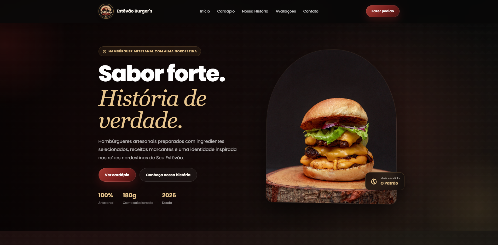
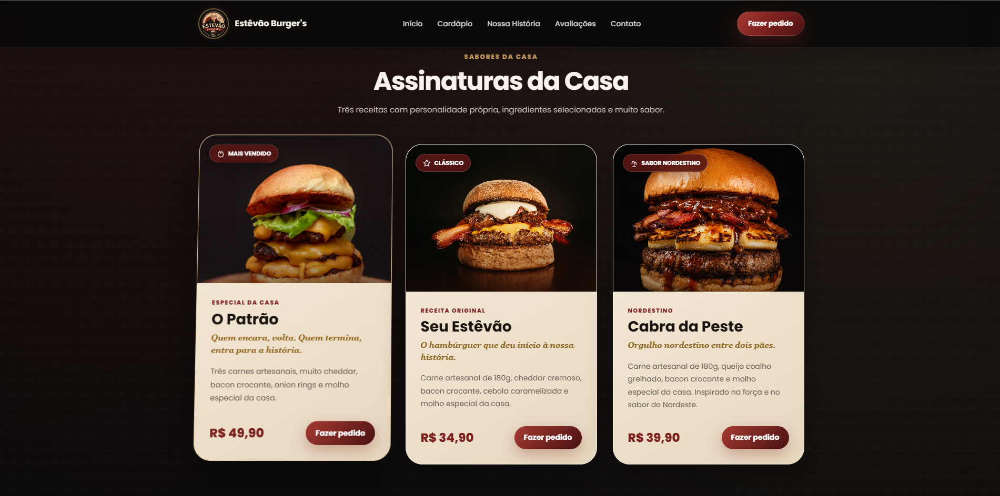
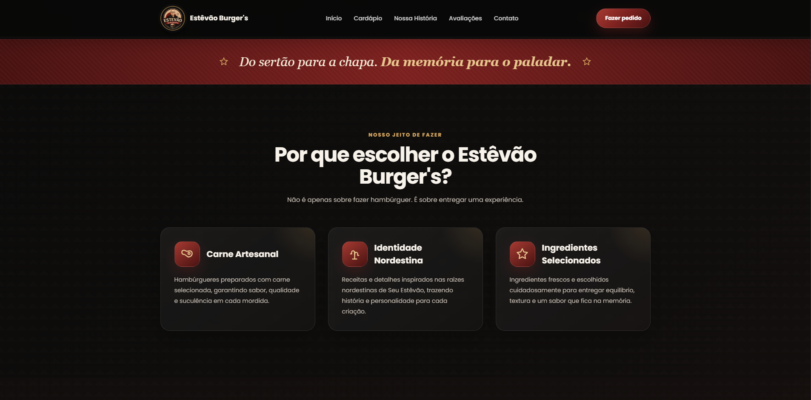
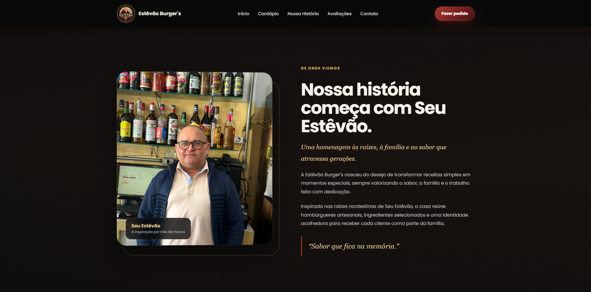
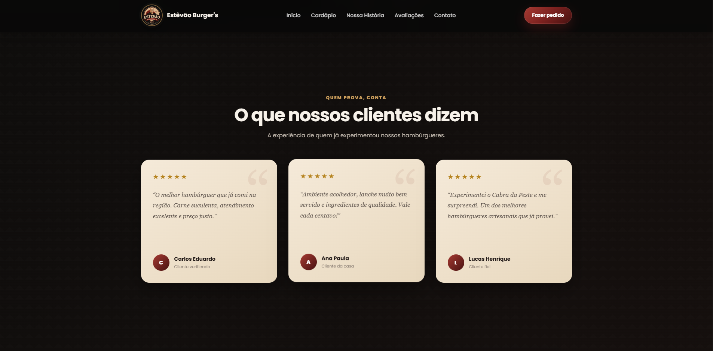
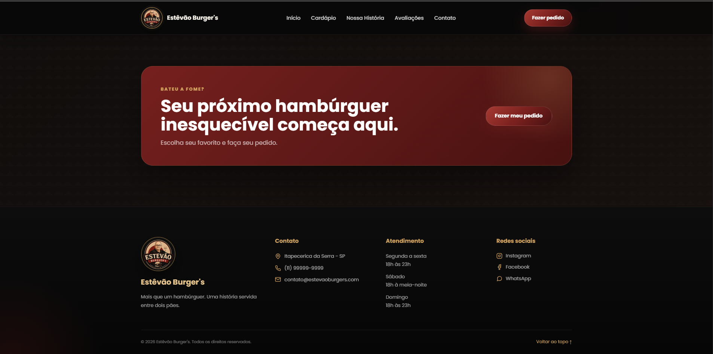

# 🍔 Estevão Burger's

Website fictício de uma hamburgueria artesanal, desenvolvido como projeto de estudo e portfólio utilizando **HTML, CSS e JavaScript**.

A proposta foi criar uma experiência visual completa para uma marca fictícia, combinando desenvolvimento Front-end, identidade visual e referências à cultura nordestina.

<p align="center">
  
</p>

---

## 💻 Sobre o projeto

O **Estevão Burger's** nasceu como um projeto fictício para colocar em prática conhecimentos de desenvolvimento web.

Além da implementação técnica, o projeto trabalha a construção de uma identidade própria para a hamburgueria, utilizando cores, tipografia, imagens e elementos visuais inspirados nas raízes nordestinas da marca.

O site foi estruturado para apresentar de forma clara o cardápio, a história da hamburgueria, seus diferenciais, avaliações fictícias e informações de contato.

> **Observação:** Estevão Burger's é uma marca fictícia criada exclusivamente para fins educacionais e de portfólio. Produtos, preços, avaliações e informações de contato apresentados na interface são demonstrativos.

---

## ✨ Funcionalidades

* Navegação entre as seções da página
* Apresentação visual dos produtos
* Cards de hambúrgueres com descrição e preço
* Seção dedicada à história da marca
* Apresentação dos diferenciais
* Área demonstrativa de avaliações
* Seção de contato
* Links para redes sociais
* Botão de retorno ao topo
* Interações desenvolvidas com JavaScript
* Interface adaptada para diferentes tamanhos de tela

---

## 🛠️ Tecnologias

<p>
  
  &nbsp;
  
  &nbsp;
  
  &nbsp;
  
  &nbsp;
  
</p>

**Principais tecnologias:**

* HTML5
* CSS3
* JavaScript
* Git
* GitHub

---

## 📸 Interface

### 🏠 Página inicial

Apresentação principal da hamburgueria, identidade da marca e chamada para conhecer o cardápio.

<p align="center">
  
</p>

### 🍔 Cardápio

Seção dedicada aos produtos, utilizando cards para organizar imagens, nomes, descrições e preços.

<p align="center">
  
</p>

### ⭐ Diferenciais

Apresentação dos principais conceitos utilizados para construir a identidade fictícia da hamburgueria.

<p align="center">
  
</p>

### 🌵 Nossa história

Seção criada para apresentar o conceito e as referências utilizadas na construção da marca.

<p align="center">
  
</p>

### 💬 Avaliações

Área demonstrativa criada para representar avaliações de clientes dentro da proposta visual do projeto.

<p align="center">
  
</p>

### 📍 Contato

Parte final da interface com informações demonstrativas de contato e navegação.

<p align="center">
  
</p>

---

## 📚 Conceitos praticados

O desenvolvimento deste projeto permitiu praticar:

* Estruturação de páginas com HTML
* HTML semântico
* Estilização com CSS
* Flexbox
* Organização de layouts
* Responsividade
* Hierarquia visual
* Manipulação do DOM
* Eventos com JavaScript
* Navegação entre seções
* Organização de arquivos
* Git e GitHub
* Desenvolvimento de interfaces
* Experiência do usuário

---

## 📁 Estrutura do projeto

```text
estevao-burgers/
│
├── assets/
│   └── screenshots/
│       ├── home.png
│       ├── cardapio.png
│       ├── diferenciais.png
│       ├── historia.png
│       ├── avaliacoes.png
│       └── contato.png
│
├── index.html
├── style.css
├── script.js
└── README.md
```

---

## ▶️ Como executar

Como o projeto utiliza tecnologias Front-end básicas, não é necessária nenhuma instalação adicional.

### 1. Clone o repositório

```bash
git clone https://github.com/eucarlosz/estevao-burgers.git
```

### 2. Acesse a pasta

```bash
cd estevao-burgers
```

### 3. Execute

Abra o arquivo:

```text
index.html
```

diretamente no navegador.

Durante o desenvolvimento, também é possível utilizar a extensão **Live Server** no Visual Studio Code.

---

## 🎯 Objetivo do projeto

O principal objetivo foi transformar conhecimentos de **HTML, CSS e JavaScript** em uma interface completa, indo além de exercícios isolados.

O projeto também permitiu trabalhar aspectos relacionados à apresentação de um produto digital, como identidade visual, organização de conteúdo, experiência de navegação e consistência entre diferentes seções.

---

## 🖥️ Demonstração

O projeto não possui deploy público.

As telas da aplicação podem ser visualizadas neste README e na pasta:

```text
assets/screenshots/
```

O **Estevão Burger's é um projeto fictício**, desenvolvido exclusivamente para estudo e composição de portfólio.

---

## 👨‍💻 Autor

**Carlos Eduardo**

Estudante de **Análise e Desenvolvimento de Sistemas — UniFECAF**

<p>
  <a href="https://www.linkedin.com/in/carloseduardocostaf/">
    
  </a>

  <a href="https://github.com/eucarlosz">
    
  </a>
</p>
